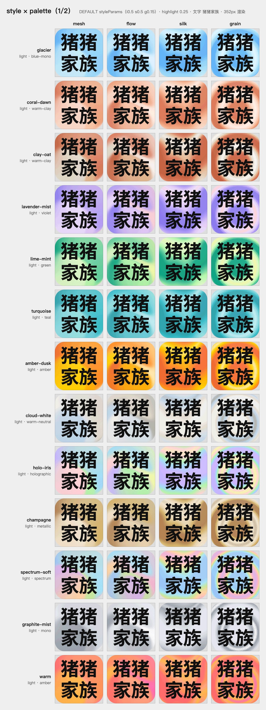
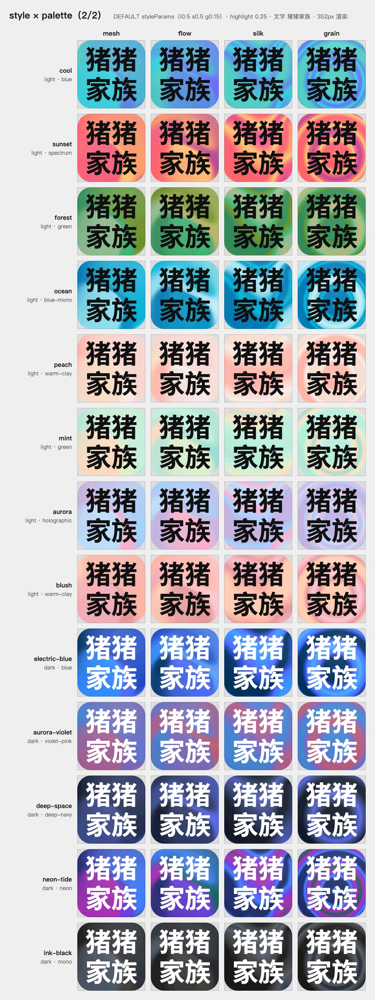
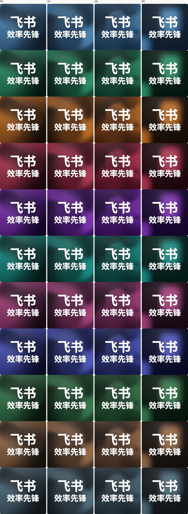
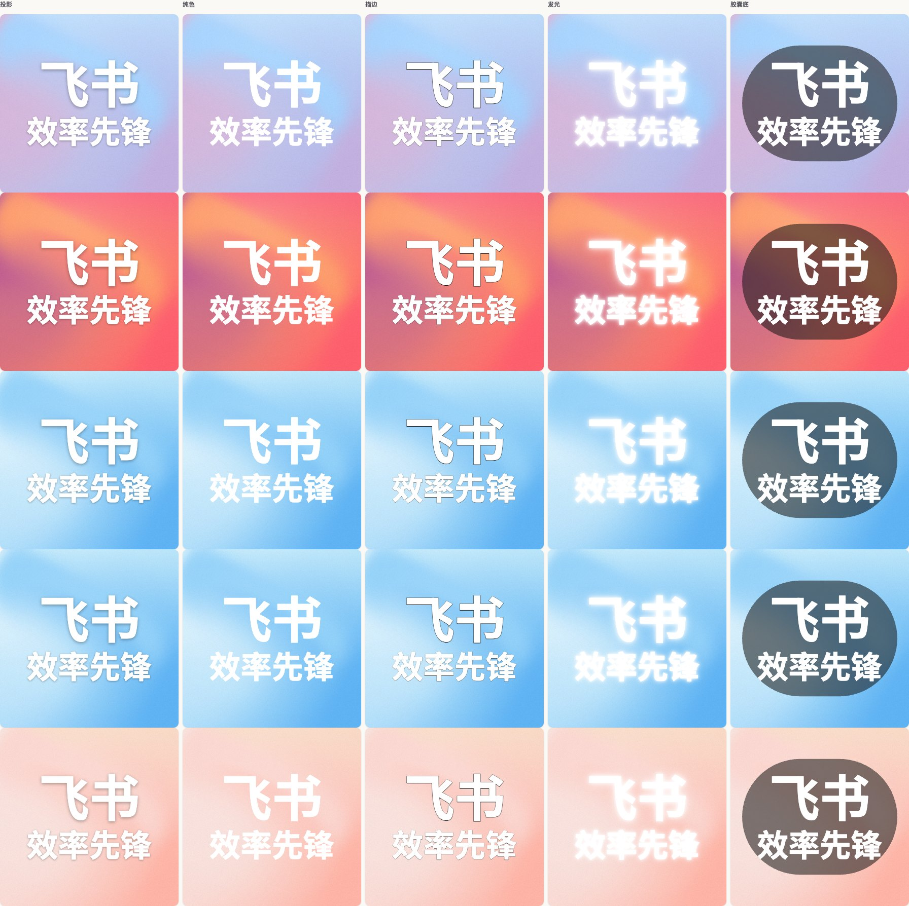

# 渐变头像

输入几个字，得到一张柔光渐变的头像。线上地址：<https://jianbiantouxiang.com>，项目与技术介绍在 <https://jianbiantouxiang.com/about>。English summary: see [below](#english).







## 它做什么

- **四种质感**：柔光（mesh）、流动（flow）、丝绸（silk）、颗粒（grain），由 WebGL2 片元着色器实时渲染。同一配置在同一设备上每次输出一致，换个种子就是一张新图。不支持 WebGL2 的浏览器会回落到静态近似渐变，导出得到的也是这张近似图。
- **37 套配色**：浅色 21 套、深色 16 套；也可以自定义 2 到 6 个颜色，或给一两个种子色，由 OKLCH 算法生成整套。
- **文字排版**：最多两行（第一行、第二行），第二行为空只渲染第一行；字号默认自动填满，一拖滑杆就以当前值切成手动，点“自动”回去；默认边距 15%、行高 1.03；第二行字号默认跟随第一行的 62%，也能单独定，两行字号互不牵连；逐行水平、垂直补偿只动自己那一行，其余行字号与位置一个像素都不变；五种文字效果（投影、纯色、描边、发光、胶囊底），默认投影 40% 且深浅字反色适配；五档从白到黑的预设色加自选，文字色就是选的那一个，没有自动挡。
- **图标**：图标节里一个开关，图标置顶、文字两行自动缩小适配；可搜 lucide 内置图标、按中文搜 emoji，或上传 SVG / PNG / WebP。内置图标跟随文字颜色与效果，emoji 跨平台取同一份 Noto SVG，上传 SVG 会先做白名单消毒且只在本次会话有效。
- **字体**：Google Fonts 全库按需加载，中文字体按 unicode-range 切片只拉用到的字，Noto Sans SC 整包 1.1 MB，实际只下载其中几十 KB；也能上传本地 TTF、OTF、WOFF、WOFF2。第一行与第二行可以分别选字体与字重，第二行默认跟随第一行。选择器里每个字体名都用这款字体自己写出来，中日韩字体显示原生名，比如站酷快乐体、しっぽり明朝，每款只下载名字那几个字，一两 KB。
- **画布与导出**：64 到 8192 像素，默认方形，也可切圆角或圆形；JPG（默认压到 2 MB 以内）、PNG、WebP；点主按钮直接触发浏览器下载，导出选项里另有“复制图片”按钮；微信内置浏览器里改为长按图片保存。
- **预览参考层**：安全区与网格参考线两个开关，在顶栏的设置菜单里，只在预览显示，导出的图上没有；开关状态记在本机。
- **存档与历史**：配置自动存在本机，刷新即恢复；本地保留最近 8 次结果。
- **界面**：五种语言（简体、繁體、English、日本語、한국어），深浅主题，可安装为 PWA。



## 怎么用

1. 打开网址，输入文字。主流聊天应用的列表头像大多在 40 像素上下，两到四个字、字重 700 最清楚。桌面上文字与图标一列、配色与质感一列，一屏摊开，不用先切页签。
2. 在“配色”和“质感”两节里挑，或者点“换一版”换一版构图（只换种子）、“随机配色”只换一套配色（种子与质感不动）。
3. 点“导出”立即下载；需要粘贴到聊天窗口时，点导出按钮右侧的设置图标，再选“复制图片”。
4. 要做部门或产品标识，在“图标”节点“选图标”挑一个内置图标、品牌图形或 emoji，也可以上传自家 logo；不想要了点旁边的叉移除，再填名称并导出。
5. 数值参数就在它管的那张卡片里：第一行字号在第一行输入下面，强度在文字样式下面，图标大小在图标磁贴下面；边距、行高、字间距收在文字卡片的“版面”里，每行与图标的水平、垂直位置收在“位置微调”里，质感的参数收在质感卡片的“参数”里，需要时展开。每行都能拖滑杆、敲数字，改过的行会出现一个回默认的小按钮。
6. 主题、参考线与恢复默认在顶栏右上角的设置菜单里。

## 本地开发

需要 Node.js 24 以上。

```bash
npm install
npm run dev          # http://localhost:5173
npm test             # vitest 单测
npm run e2e          # Playwright，桌面与 iPhone 15 两组
npm run screenshots  # 设备模拟截图到 .screenshots/
npm run build        # 产物在 dist/
npm run budget       # 构建后报一次首屏 JS 体积，只作参考
npm run samples      # 重生成 README 的样张
npm run gen:icons    # 从已安装的 lucide-react 重建图标索引
npm run gen:emoji    # 从 emojibase-data 重建五语 emoji 索引（需要网络）
npm run gen:app-icons # 用本机 chromium 把 SVG 应用图标位图化
```

界面组件来自 shadcnblocks 与 React Bits Pro 两个付费 registry，装进来之后就是仓库里的普通源码，构建和部署都不需要密钥。只有再从 registry 拉新组件时，才要在 `.env.local` 里放密钥。

## 部署

主站在阿里云 ESA Pages，构建配置在 `esa.jsonc`；旧域名留在 Cloudflare Pages 做 301。接入、缓存规则与上线核对命令见 `docs/deploy.md`。

## 技术说明

- Vite 8、React 19、TypeScript、Tailwind CSS v4、shadcn/ui（Base UI 底层）、zustand。
- 渲染引擎是 [@paper-design/shaders](https://github.com/paper-design/shaders)（Apache-2.0）的 `staticMeshGradient`、`meshGradient`、`warp`、`grainGradient` 四个着色器，项目只做种子映射、离屏渲染与限幅。
- 内置图标来自 lucide-react 1.37（ISC），emoji 索引来自 emojibase-data 15.0.0（MIT），emoji 图形来自 Noto Emoji v2.047（Apache-2.0）；索引产物入库，选择器按需加载。
- 内置品牌图形 58 个，文件随站点同源分发，索引与加载器都是懒 chunk。
- 颜色计算用 culori，全部在 OKLCH 空间做。
- 着色器、字体选择器、品牌索引都按需加载；首屏体积口径见 `docs/architecture.md`。

文档：

| 想看什么 | 去哪看 |
| --- | --- |
| 模块划分与数据流 | `docs/architecture.md` |
| 为什么选这条技术路线 | `docs/adr/`、`docs/research/` |
| 规约与实施计划 | `specs/` |
| 踩过的坑 | `docs/engineering-lessons.md` |
| 跨会话项目记忆 | `docs/memory/` |
| 参与开发 | `docs/contributing.md` |

## 与 v2 的关系

v3 是整体重写。v2 的 SVG 多层径向渐变、SVG 导出与命令行工具都已下线：渲染换成了着色器，头像也只需要位图。要用旧版本，切到 `v2.3.0` 标签。变更细节见 `CHANGELOG.md`。

## 素材与致谢

- 内置品牌图形取自 [dashboard-icons](https://github.com/homarr-labs/dashboard-icons)（Apache-2.0）。图形本身按该许可分发，各品牌名称与标识的商标权归其所有者，本项目不主张任何权利，也不代表与这些品牌有关联或获得其背书。
- 飞书、豆包工作、WorkBuddy 三个图形用的是 owner 手上的官方素材，Qoder 是照官方标识描摹的矢量。清单在 `scripts/brand-list.json`，跑 `npm run gen:brand` 重出。
- [Justin Jay Wang](https://justinjay.wang/methods-for-random-gradients/) 的多层径向渐变方法是 v1 与 v2 的出发点。
- [Paper](https://paper.design) 开源的 shader 库让 v3 的四种质感不必从零写 GLSL。

## English

Gradient Avatar turns a few characters into a soft, luminous gradient avatar, entirely in the browser. Try it at <https://jianbiantouxiang.com>.

What it does: four WebGL2 textures (mesh, flow, silk, and grain without circular ripple seeds); 37 palettes plus OKLCH palette generation from one or two seed colors; any Google Font, with CJK fonts loaded as unicode-range slices, a separate font and weight for each line, and a picker that renders every font name in its own typeface; auto-fit typography with 15% padding, 1.03 line height, and per-line size and nudge controls; one-click browser download and PNG clipboard copy; JPG, PNG, and WebP export with a file-size target; safe-area and grid overlays for the preview only; settings persist locally; five UI languages; installable as a PWA.

Assets: brand graphics come from [dashboard-icons](https://github.com/homarr-labs/dashboard-icons) (Apache-2.0); every brand name and logo remains the trademark of its owner, and their inclusion implies no affiliation or endorsement.

Development: `npm install && npm run dev` (Node 24+). Deployment is a static build (`npm run build`, output `dist`); hosting notes live in `docs/deploy.md`.

## 许可

MIT，见 `LICENSE`。
