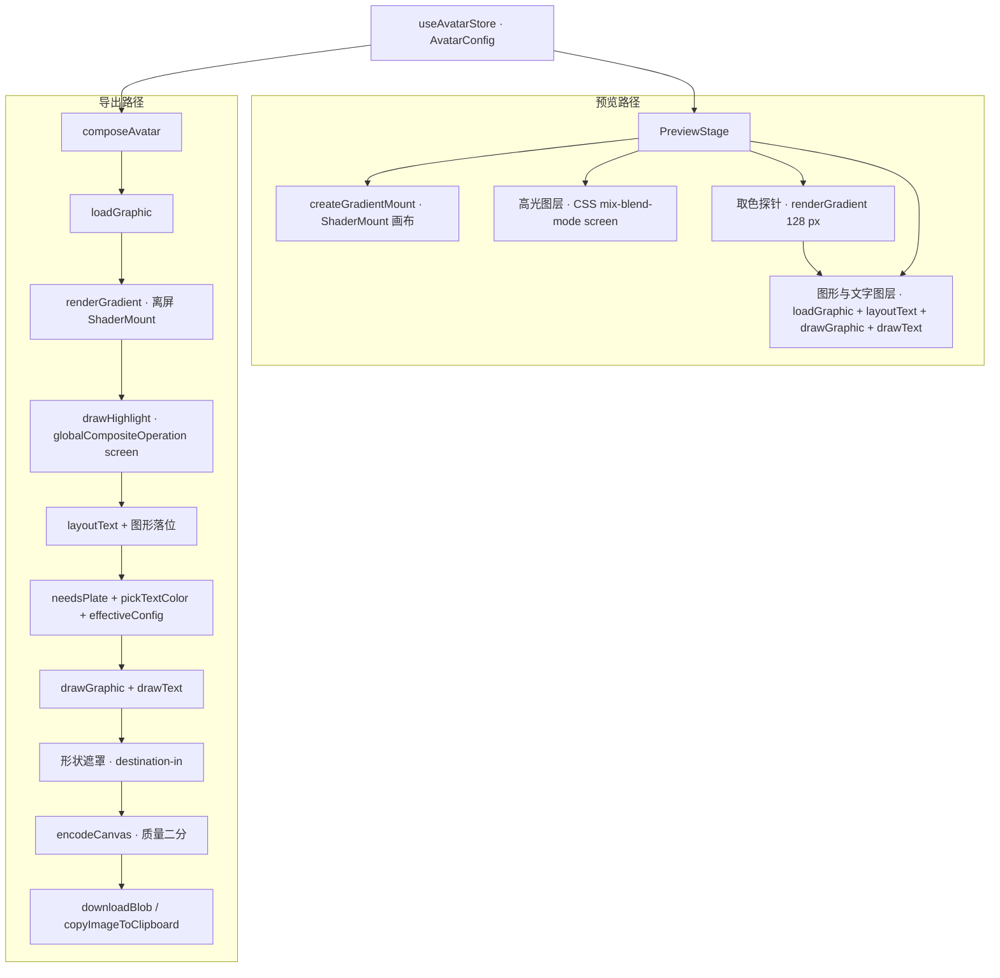

# 架构

渐变头像生成器是一个纯前端静态站：一份可序列化的 `AvatarConfig` 驱动 WebGL 渲染与 2D 合成，产出一张位图并落到磁盘或图片剪贴板。

## 技术栈

| 层 | 选型 | 说明 |
| --- | --- | --- |
| 构建 | Vite 8、`@vitejs/plugin-react`、`vite-plugin-pwa` | 单包根目录应用，产物在 `dist/` |
| 语言 | TypeScript 6 | `strict` 加 `noUncheckedIndexedAccess`，路径别名只用 `@/` |
| 框架 | React 19 | 无路由，两个入口：`index.html`、`about.html`（`appType: 'mpa'`，详见“构建与部署”） |
| 样式 | Tailwind CSS v4、`@tailwindcss/vite` | 主题走 CSS 变量，深浅两套 |
| 组件 | shadcn/ui（CLI 4，Base UI 底层）、lucide-react、cmdk、sonner | 原语在 `src/components/ui/`，跟随上游 |
| 状态 | zustand 5 | 单 store，模块加载即读本机存档 |
| 渲染 | `@paper-design/shaders` 0.0.80 | WebGL2 fragment shader，Apache-2.0 |
| 颜色 | culori 4 | 全部计算在 OKLCH 空间 |
| 测试 | Vitest 4（jsdom）、Testing Library、Playwright 1.62 | 单测加两组端到端 |
| 规范 | ESLint 10、typescript-eslint、Prettier | `src/components/ui` 与散文目录不进格式化 |
| 托管 | 阿里云 ESA Pages（主站）、Cloudflare Pages（旧域名 301） | 构建 `npm run build`，输出 `dist`；构建配置在 `esa.jsonc`，接入步骤与核对命令见 `docs/deploy.md` |

## 目录结构

| 路径 | 职责 |
| --- | --- |
| `src/main.tsx` | 挂 React 根，接上系统主题监听，按条件装端到端探针 |
| `src/App.tsx` | 套 i18n Provider，让文档标题与默认示例文字跟随界面语言 |
| `src/app/` | 应用外壳、顶栏、底部操作条、实时预览与参考层开关、预览高度、氛围背景、主题状态 |
| `src/app/workspace/` | 挑选栏两列（文字、图标 / 配色、质感），四张卡片各带自己的数值滑杆与折叠组，手机分隔条 |
| `src/app/panels/` | 导出抽屉、字体选择器、图形选择器、历史条四个重件 |
| `src/about/` | 关于页那一小段脚本与赞赏配置。正文在根目录的 `about.html` 里 |
| `src/components/ui/` | shadcn 生成的原语，本仓不改写、不格式化 |
| `src/components/blocks/` | 界面复用件：分段控件、radio card、带数值框与重置钮的滑杆、“自动”与“跟随”共用的开关钮、颜色格、可折叠分组 |
| `src/engine/` | 质感定义与参数映射、种子、预览挂载、离屏渲染、设备能力探测、无 WebGL2 兜底 |
| `src/engine/shaders/` | 四段 fragment shader 源码，一种质感一份 chunk |
| `src/text/` | 文字量测、换行、自动填满、排版、绘制、明暗判定 |
| `src/palettes/` | 37 套内置配色、OKLCH 色彩工具、种子色和谐生成 |
| `src/fonts/` | 精选清单与原生名表、fontsource 目录缓存与条目查找、按行加载的 css2 与镜像加载链、字体名预览、本地上传注册 |
| `src/fonts/family.ts` | font-family 与 canvas font 简写的字符串工具。`src/text` 引用它，`src/fonts` 不引用 `src/text` |
| `src/graphics/` | 图形来源分派、lucide Path2D、Noto Emoji、上传消毒、五语 emoji 索引、图形绘制 |
| `src/graphics/generated/` | lucide 全库与精选索引、emoji 基础索引与五语标签，由 `npm run gen:icons` / `gen:emoji` 生成 |
| `src/export/` | 画布合成、编码与体积二分、导出动作、下载、图片剪贴板、文件名 |
| `src/state/` | `AvatarConfig` 契约、zustand store、本地存档、历史 |
| `src/i18n/` | 五份扁平字典与 Provider |
| `src/hooks/` | 媒体查询与防抖 |
| `src/lib/` | 画布小工具（含画布属性的像素串 `cssPx`）与 `cn`：engine、export、text、fonts 共用的最底层，不依赖任何业务目录 |
| `tests/` | Vitest 单测，目录与 `src/` 同名 |
| `e2e/` | Playwright 用例，`smoke` 两档都跑，`desktop` 与 `mobile` 各归一档 |
| `scripts/screenshots.mjs` | 设备模拟截图，输出到 `.screenshots/` |
| `public/` | 图标、`_headers`、`_redirects`（只在 Cloudflare Pages 上生效），随构建进入 `dist/` |

## 界面结构

顶栏之下是一棵组件树，用断点切三种形态，不按视口宽度分支渲染：两套树会让状态与焦点在断点处丢失。
视觉顺序由 CSS grid 的行列指定，DOM 顺序按手机排，预览、分隔条、挑选栏两列、操作条。

预览列不再是 `1fr` 捡漏，而是夹在 400 到 640 之间的定宽轨道，富余全给挑选栏：
捡漏时 1920 上画框吃到 890 px，三列控制面板被压到 400，配色与质感整组滚出首屏。
工作台外壳 `lg:max-w-[1520px]` 居中封顶；96rem 以上把两条 clamp 冻成字面值，
因为 `vw` 永远对真实视口取值而容器已被封顶钉死，1647 px 以上不冻就会溢出被裁。

| 断点 | 形态 |
| --- | --- |
| ≥1120 | 挑选栏拆两列（文字图标 / 配色质感），右边是预览 |
| 1024 到 1120 | 挑选栏并回一列，壳内自己拆两列 |
| <1024 | 纵向栈：预览 sticky 在顶栏下，下面一条可拖的分隔条，再往下是挑选栏四节，末尾一行备案号 |

列模板与落位全在 `src/index.css` 的 `[data-slot='workspace']` 一段，三套断点；
`display` 也归那里管，工具层排在组件层之后，class 里留一个 `flex` 就会压掉 `display: contents`。
壳内拆两列用有界 media 查询而不是容器查询：壳在拆列档是 `display: contents`，不生成盒，
承担不了 `container-type`；壳宽又完全由视口断点决定，容器查询量不到新信息。

只有画框那一列分上下两行，左边几列一律跨满两行。操作条只占画框那一列，
左边如果也停在第一行末尾，底下就空出一条与操作条等高的带子，挑选栏白白少掉五六十像素可视高度。

操作条只占画框那一列，不横跨整个工作台：挑选栏底下压一条通栏的操作条，
会让人以为它管的是左边那两列，而它管的其实是画面。
桌面上它是一行三列 grid：换一版、随机配色、导出，导出那格右侧带一颗导出选项齿轮。
每颗按钮的名字就是它改动的东西：换一版只换种子，随机配色只换配色，种子与质感不动；
三格文案都短到一格放得下，手机与桌面同一套文案。
手机上它固定在屏幕底并让出 safe-area，图标在上、短文案在下的三格加齿轮。

挑选栏分列的依据是使用频率：改文字与换配色是最常用的两件事，让它们同屏并排，不用先切页签也不用滚一屏。
左列是文字与图标，右列是配色与质感。没有页签，没有手风琴，折叠只给低频参数：自定义配色、种子色生成，以及文字卡片的“版面”与“位置微调”、图标卡片的“位置微调”、质感卡片的“参数”。
四节都按桌面一屏放得下致密化：配色是六列无名磁贴，渐变本身就是名字，
选中配色的五语名显示在节头，全名挂在磁贴的 title 与 sr-only 上；质感是单行四格加一行常显的选中描述；
图标是单控件两态——空态一颗整宽虚线按钮，填充态是缩略图磁贴（点它换）加名字加移除钮；
文字样式是可换行的 chips：分段控件在 250–300 px 的列里会把选项截成“Shad…”，chips 按内容自适应。

数值滑杆没有单独的面板，按归属散在四张卡片里，参数跟着它修饰的东西走。
文字卡片自上而下：第一行输入、第一行字体、第一行字号（带“自动”钮），第二行输入、第二行字体（第二行有内容才出现）、
第二行字号（两行都有内容才出现），这两条各带一颗“跟随”钮；再往下是文字样式与强度、文字颜色一行（五个预设加一个自定义色块），
最后是折叠的“版面”（边距、行高、字间距）与“位置微调”（每行的水平与垂直）。字体排在字号之上：换字体比调字号常用，自动字号本身也由字体决定。
图标卡片填充态在磁贴下面放图标大小，再是折叠的“位置微调”（水平、垂直）；空态没有滑杆。
质感卡片在种子行之后是折叠的“参数”（当前质感的五个参数加光感）。折叠组默认收起，用不上的行不出现。
每行 38 px 两段：第一段是「标签、自动档、重置占位、数值框」的固定列 grid，第二段滑杆独占一行。
重置占位与数值框各占定宽列，位置与兄弟元素有无无关；数值框放最右一列，右缘与滑杆右端齐平，
占位排在它右边时每一行的数字都比滑杆末端缩进 26 px，整列看起来像没有右对齐。
致密尺寸一律 `lg:` 前缀：手机渲染同一棵树，基值要保持 44 px 触控与 16 px 输入字号的口径。
折叠组用 Base UI 的 Collapsible，收起时面板整块卸载而不是 `display:none`：Base UI 的滑杆在挂载那一刻量控件宽度，
在 `display:none` 里挂上就量到 0，之后即使显示出来滑块也一直是 `visibility: hidden`；卸载再挂载量到的是真实宽度。
每行的数字框常驻，回车或失焦按步进对齐并夹回区间；给了默认值的行在偏离默认时多出一个重置钮，
桌面悬停或聚焦才显形，触控设备常显。字号那一行不给默认值：回默认由“自动”按钮承担。
画布尺寸与形状不在卡片里，它们跟格式与体积是同一件事，收在导出抽屉里。

每行的字体是一行标签加一行控件，模块 `src/app/workspace/sections/line-font-field.tsx`。左边字体按钮占满剩余宽度，写 `displayName` 给出的显示名，
右侧是与下拉同款的下箭头；可访问名同时引用行标签与字体名，`title` 写西文 family。右边字重下拉定宽，
收起态只写字重名，选项是名字加右侧等宽数值，名字按该档字重渲染；字体只有一档时下拉禁用，占位不变。
字重用 shadcn 的 Select（Base UI），不用原生 select：原生 select 收起后只能显示选项全文，生成的 native-select 又把手机高度写死在 32 px。
下拉触发器的高度写成 `data-[size=default]:h-11`，才压得过生成件同前缀的默认高度。
第二行的字体与字号默认跟随第一行，标签后的“跟随”钮与第一行字号的“自动”钮是同一个块 `AutoToggle`：
按下态表示这个值由系统派生，带 `aria-disabled`，再点不做事；可见尺寸致密，热区用伪元素上下各扩 11 px，手机上凑满 44 px。
第二行跟随时按钮文字用次要前景色。`ui.fontFallbacks` 含某一行生效字体的 `fontKey` 时，那一行按钮的名字前多一个琥珀色告警图标，
读屏读“没加载成功，正用系统字体显示”。

字体选择器按行打开，勾选态与写入都对着那一行，写入只经 `withLine1Font`、`withLine2Font`。桌面是锚在字体按钮下方的弹层，
不带遮罩，画布照常可见；弹层只在按钮上下两侧翻转，不翻到左右，列表高度随所在一侧的可用高度收放。
这是 Base UI 给自家下拉与菜单用的口径（`collisionAvoidance.fallbackAxisSide: 'none'`）：允许翻到侧面时，
第一帧的全长列表会把弹层推到右侧并停在那里。生成的 `PopoverContent` 不转发这个参数，所以字体行直接组 Base UI 的 Positioner 与 Popup，外观照抄 `ui/popover`。
手机是底部抽屉，抽屉头写“第一行字体”或“第二行字体”。
分组自上而下：已上传（本会话注册过的上传字体，至多三款）、最近使用（只记 Google 字体，至多 8 条，存在 `gradient-avatar:recent-fonts`）、
精选若干组、全部（至多 200 条，靠搜索收窄）、系统，最后是上传按钮。精选按界面语言排组：简体界面简、繁、日、韩、拉丁，
繁体界面繁、简、日、韩、拉丁，日文界面日、拉丁、简、繁、韩，韩文界面韩、拉丁、简、繁、日，英文界面拉丁、简、繁、日、韩；
繁体组同收台湾与香港两类，组内保持 `curated.ts` 的手工顺序，搜索时才按命中强度排。
打开时高亮该行当前字体在列表里第一次出现的那一项，勾选项带一段只给读屏的“当前”；点中该行当前那款只关弹层，不写配置。
搜索词与上传报错随面板挂载初始化，关掉再开是干净的。选择器的行与卡片上的字体按钮都用字体自身写名字，见“字体”一节的字体名预览。

顶栏自左向右：品牌、备案号、撤销重做、最近生成、语言、设置、关于。备案号是浅色小字，链到工信部备案系统，
手机顶栏放不下，改在挑选栏末尾居中一行。最近生成收在顶栏右上角的浮层里，与撤销重做同一处落点：三个都是“回到刚才那一版”。
设置菜单收主题三档、网格与安全区参考线、恢复默认：这四样都是跨会话的偏好而不是对画面的动作，
一个功能面很窄的单画布工具，拆两处放使用者记不住哪个在哪。恢复默认带一次确认；它走撤销栈，确认之后还能撤销回去。

预览尺寸两条路。手机上由 `--preview-h`（默认 28svh，范围 20 到 60）决定预览区高度，画布边长取
`min(100vw - 32px, var(--preview-h) - 40px)`；分隔条拖动改这个变量，双击回默认，上下键每次 4svh，值存
localStorage `gradient-avatar:preview-height`，模块 `src/app/preview-height.ts` 与参考层开关同构。
桌面上由外壳给出 `--preview-max`（`100svh - 200px`），也就是这一列留给预览的净空，
画框取 `min(var(--preview-max), 640px)`：640 已足够判断渐变与文字细节，再大只会把控制面板压出首屏。
预览这一格是 `overflow-hidden` 而不是可滚：画框已经按净空夹过一次，再挂一条滚动条只会出现在没人需要它的地方。

## 共享契约

`src/state/config.ts` 的 `AvatarConfig` 是全仓唯一的参数来源。它同时是 localStorage 的存档格式与历史条目的内容。项目在开发期，契约随需要改结构，不写迁移：换结构就升 `src/state/persist.ts` 的 `PERSIST_KEY`，旧存档不读。`normalizeConfig` 负责同一结构下的残缺与越界输入，缺的补默认，越界的夹回。

| 字段组 | 内容 | 谁在读 |
| --- | --- | --- |
| `text`、`seed` | 文字内容与随机种子，`seed` 为空时由 `text` 哈希派生 | 引擎、文字、文件名 |
| `style`、`styleParams` | 四种质感之一，加强度、柔和度、颗粒、比例、旋转五个归一化滑杆 | 引擎 |
| `highlight` | 2D 合成阶段的柔白高光强度 | 合成 |
| `palette`、`customColors` | 内置配色 id 或 `custom`，自定义时给 2 到 6 个 hex | 配色、引擎 |
| `canvas` | 宽高、形状、圆角比例 | 合成、导出 |
| `typography` | 逐行参数两组 `line1`、`line2`，每组是字体（family、来源、字重）、字号与水平垂直两向补偿；两行共用的边距、行高、字间距、文字效果与强度、颜色、胶囊底参数。两组里的 `null` 表示由系统派生：第一行字号由求解器派生，第二行的字体与字号由第一行派生 | 文字、字体 |
| `layout` | 图形比例、图形来源与品牌单色开关（`icon.mono`，仅品牌来源生效，默认 `false`）；v4 起无用途分派，图标、第一行、第二行一个纵向栈 | 文字排版、图形 |
| `exportOptions` | 格式、体积档、底色 | 编码 |

同一模块另外导出三个函数。`DEFAULT_CONFIG` 是默认值的唯一定义处；`normalizeConfig` 把任意局部输入补成完整配置，数值按区间夹值、枚举做合法性校验，任何输入都不抛错；`configHash` 对键排序后做 FNV-1a，用作历史去重与渲染去重的标记。

字体整份成立或整份作废：family 去掉首尾空白后非空、来源是 google、system、upload 之一才成立，字重取整到 100 到 900 九档。第一行字体作废回默认字体，第二行字体作废即跟随。字号与补偿的区间是导出常量：`LINE_SIZE_MIN` 0.04、`LINE2_SIZE_MIN` 0.02、`LINE_SIZE_MAX` 0.92、`LINE_OFFSET_MAX` 0.25，第二行跟随时的比例 `LINE2_FOLLOW_SCALE` 0.62，两行之间的留白比例 `LINE_GAP_RATIO` 0.18。

逐行字体的读写也收在这里。`lineFont(t, line)` 取某一行的生效字体，第二行为 `null` 时就是第一行那款；`fontKey` 是一款字体的身份键，来源、family、字重任一不同就是另一款。写字体只走三个函数：`withLine1Font` 写第一行，第二行只改过字重时随第一行换款并吸附字重；`withLine2Font` 写第二行，与第一行全相同时写 `null` 回到跟随；`FOLLOW_LINE1` 把第二行写回跟随。`nearestWeight` 把字重吸附到字体真有的一档，`twoLinesOf` 是两行模型对换行的唯一解释，归一、排版、字体加载与界面共用。

## 渲染管线

预览与导出走两条独立的路径，共用引擎、文字与图形三个模块，因此参数改动只需落在一处。

预览把三层叠在一个定长方框里：底下是 `ShaderMount` 的 WebGL 画布，中间一张 2D 画布画高光，上面一张 2D 画布按“先图形后文字”绘制，形状裁切交给 CSS。配置停 80 ms 才推给 shader；图形只按来源与 id 变化重新加载。

导出的顺序是硬性的。高光要压在渐变之上，形状遮罩必须最后做，否则被裁掉的边角会被后续绘制重新填满。合成逻辑在 `src/export/compose-core.ts`，引擎、文字、字体与图形四个模块的真实实现在 `compose.ts` 一处装配，单测因此不必拉起 WebGL、字体网络或 emoji CDN。

## 四种质感

`src/engine/styles.ts` 是引擎里唯一知道 shader uniform 名字的地方。质感卡片的“参数”组只认 `styleParams` 的五个滑杆，渲染层只认 `StyleRenderPlan`，换 shader 或调区间都只动这一个文件。

| 质感 | 底层 shader | 参数映射要点 |
| --- | --- | --- |
| `mesh` 柔光 | `staticMeshGradient` | 强度映射到 `u_waveX` 与 `u_waveY`，柔和度映射到 `u_mixing`，两者铺满全程 |
| `flow` 流动 | `meshGradient` | 强度映射到 `u_distortion`，柔和度映射到 `u_swirl` 的补，构图由 `frame` 定 |
| `silk` 丝绸 | `warp` | 底纹以 stripes 为主，浅配色按 OKLCH 平均明度线性压制 `u_distortion` 与 `u_swirl` |
| `grain` 颗粒 | `grainGradient` | 形状池只取 wave 与 corners，去掉会出同心圆的 ripple；两种形状共用 0.45 的缩放倍率 |

包内的四组常量抄进 `styles.ts` 并注明来源，不从包里 import：`meta` 与 shader 源码同在一个模块，静态引用 `meta` 会把那段 GLSL 拖进首屏 chunk。升级包版本时对照 `dist/` 复核这四组值。

`warp` 没有颗粒 uniform，缺的那份由 `src/engine/film-grain.ts` 在 2D 阶段补上，做法是一张种子噪声小图平铺后 overlay 混合。

## 文字排版

只有一种版式：图标（可选）→ 第一行 → 第二行的纵向栈，水平居中，整体在可用区域里垂直居中。`fitStack` 在 `LINE_SIZE_MIN` 到 `LINE_SIZE_MAX` 之间二分 12 轮找基准字号，第二行的 `line2.size` 为 `null` 时等于基准乘 `LINE2_FOLLOW_SCALE`，定了短边比例就按定值排，两种情况都只搜基准一个自由度，两档都放开会有无穷多组解落在安全框里。每一段带自己的字体：第一行取 `line1.font`，第二行取 `lineFont(t, 2)`，量宽与绘制都用 `src/fonts/family.ts` 的 `fontString` 拼出这一段的 canvas font。严格档要求不劈开拉丁词且主行不折行，放不下才落宽松档。

每一行可以按自己那组的 `offsetX`（画布宽比例）与 `offsetY`（画布高比例）做视觉补偿，图标按 `graphicOffsetX`、`graphicOffsetY`（安全框宽高比例）补偿。补偿不参与求解：换行与二分都按完整安全区算，落位时做纯位移，改第 i 行只动第 i 行，其余行的字号与坐标一个像素都不变；图标补偿也不挤压文字可用区。位移后越出安全区只反映在 `overflow` 提示里，不缩字号。绘制层按段设置 `ctx.font`，字号与字体都按段走，描边、投影、发光的尺度也随之按段走。第一行为空、第二行有内容是合法槽位（图标加说明文字），空槽位留住，第二行晋升为主行时整组取 `line2` 的字体、字号与补偿。

第一行字号 `line1.size` 为 `null` 时自动，由 `fitStack` 求解，`TextLayout.fontRatio` 带出求得的基准比例，预览每次排版后把它写进 store 的 `ui.autoFontSize`。这是派生值，不进配置与存档。字号滑杆常驻可用：自动态显示这个回写值，一拖就以它为起点写成定值，旁边的“自动”按钮把 `line1.size` 写回 `null`，滑杆停在刚才的定值上直到新解回写，画面全程不跳。

安全框由 `typography.padding` 从画布四边扣出，默认值 0.15；`typography.lineHeight` 默认 1.03。量宽一律走 canvas `measureText`，CJK 逐字换行、拉丁按词换行。

文字色就是用户挑的那一个，预览与导出读同一个字段，没有第二条判定路径。`src/text/ink.ts` 只留纯色彩数学，供配色表与选择器判明暗。

图标进栈在 `layoutText` 里落位。图形先按安全框高度的 `layout.graphic` 等比缩放，宽度超出时改按宽度约束，占栈顶；文字拿到剩余高度，两行一起缩小到放得下为止。文字为空时图形居中，图形缺失时文字退回整块安全框居中。

## 图形来源

`src/graphics/source.ts` 是唯一分派入口：内置图标、emoji、品牌图形与上传图形都按需 `import()`，主界面不带索引。四种来源统一返回 `Graphic`，调用方不认识具体实现。

| 来源 | 索引 | 图形 |
| --- | --- | --- |
| 内置图标 | lucide-react 1.37 的 1790 个主图标；精选 162 个随选择器小索引加载，全库 470 KB 原始数据只在搜索超出精选时加载 | `__iconNode` 转 `Path2D`，按文字色描边，并复用文字效果 |
| emoji | emojibase-data 15.0.0 的 1879 个可分组条目，五种语言各一份标签 chunk | 按码点取 Noto Emoji v2.047 单个 SVG，fetch 转 Blob 再画，保留原色 |
| 品牌 | `src/graphics/generated/brand-index.ts` 的 58 个条目，六类分组，带中英文名、别名与官方单色变体名（`white` 字段，14 个条目有值） | 同源静态文件 `public/brand/<id>.svg\|png`，SVG 走 fetch 加消毒再转 Blob，PNG 直接 `Image`，保留原色 |
| 上传 | 无索引，模块级会话注册表 | SVG 先经元素与属性白名单重建；PNG / WebP 直接 `Image`，保留原色 |

品牌图形的清单真源是 `scripts/brand-list.json`，`npm run gen:brand` 把远端条目从 homarr-labs/dashboard-icons 拉下来、把 `assets/brand/` 里 owner 提供的素材拷过去，统一落到 `public/brand/`，同时生成索引；两个产物都不手改。

单色由 `layout.icon.mono` 这个布尔字段控制，只在 `icon.source === 'brand'` 时生效，默认 `false`。58 个品牌里 14 个有上游给的官方单色稿（如 `github-light`），`brand.ts` 的 `fileOf()` 命中就取它，保留品牌自己处理过的镂空与留白；其余 44 个取原色稿交给绘制期处理。`src/graphics/draw.ts` 的 `paintMono()` 把图形画到一张按落位尺寸开的离屏画布，`globalCompositeOperation = 'source-in'` 填当前文字色再贴回主画布，官方单色稿与原色稿走同一条着色路径，预览与导出共用；离屏画布不缓存，取不到 2D 上下文就退回原色绘制。挑选栏“图标”节的分段控件与选择器里的分段控件读写同一份配置字段。

索引与加载器都只在图形选择器或 `loadGraphic` 命中 brand 时才 `import()`，不进首屏预算。SVG 与上传路径同过一遍 `sanitizeSvg`，取不到或解析失败只 `console.warn` 并让图形位留空。

上传 SVG 只保留常见绘图元素、渐变、裁剪与安全展示属性；未知元素整支丢弃，未知属性删除，`url()` 只允许内部引用。文件字节只在模块级会话注册表里，不写盘；配置里留的是 `source: 'upload'` 加会话 id，会随存档与历史落盘，刷新后注册表已空，图形位留空、图形节仍显示上传来源，用户重新上传即可。加载失败同样只让图形位留空，渐变、文字与导出继续可用。

## 字体

加载器 `src/fonts/loader.ts` 对外三个函数。绘制前必须等 `document.fonts.load` 就绪，否则画布会用回退字形出图。

- `fontJobs(config)` 给出哪款字体要画哪些字：有文字的行按 `lineFont` 取生效字体，同一款字体的两行文字合并成一条；两行都空时给第一行字体，用拉丁与 CJK 各一个字的样本探测。第二行钉了别款字体但还没有文字时不加载它。预览的字体 effect 以这组字体的 `fontKey` 串为依赖，填上第二行文字后依赖变化，effect 重跑，把第二行的字体加载进来。
- `loadFontsForConfig(config)` 对每条并行加载，每款返回 `{ font, via, ok }`：`font` 是输入的那款，界面据它的来源选提示文案；`via` 是实际走的通道（google、mirror、system、upload）。预览、导出、长按图与历史缩略图都走它。加载状态以 `fontKey` 为键，同一款字体只请求一次。
- `topUpGlyphs(config)` 给已就绪的网络字体补上新出现的字，确实补到时返回 true，预览据此重绘一次。css2 按 `unicode-range` 切片下发，新字所在的切片要再 `load` 一次才会去拉；没就绪或加载失败的字体不补。

目录条目只从 `src/fonts/catalog.ts` 的 `findFontEntry(family)` 同步查：先查精选清单，再查内存目录，按去掉首尾空白后的小写比较。内存目录第一次被访问时从本地缓存解析一次，不看有效期，`fetchCatalog` 拉到新目录时替换；有效期只决定选择器打开时要不要刷新列表，过期条目的 id、字重与版本照样可用。查不到条目时按 family 猜 fontsource id。同一文件的 `weightsOf(family)` 给字重控件用，查不到条目时给一份通用档位；`displayName(family, source)` 是界面上字体名的唯一入口，选择器的行、卡片按钮、预览子集的 `text=` 与搜索都调它：上传字体去掉 `-upload` 后缀，其余有原生名的写原生名，没有的写 family。

| 档 | 来源 | 说明 |
| --- | --- | --- |
| 1 | Google Fonts css2 | 返回的 `@font-face` 全部带 `unicode-range`，浏览器只拉用到的切片，常用汉字所在的切片 24 到 43 KB。不加 `text=`：文字每改一个字就是一份新子集，CSS 只缓存一天；按切片的静态字体文件缓存一年，换了文字也能复用 |
| 2 | `cdn.jsdelivr.net` 上的 `@fontsource` CSS | 走 npm 包路径，每条分片都带 `unicode-range` |
| 3 | `fastly.jsdelivr.net` 上的同一份 CSS | 同上，走 Fastly，与第二档不在同一张 CDN 上 |
| 4 | 系统字体栈 | 界面提示已回落 |

每一档各有 4 秒等待上限。字体目录来自 fontsource 公共 API，按 7 天缓存进 localStorage 的 `gradient-avatar:font-catalog:v1`，每条只留 id、版本、family、字重与由 subset 派生的 `cjk`；只保留 `type` 为 google 的非图标条目，字重只收 100 到 900 九档。接口不可用时回落到 `curated.ts` 的精选清单，它覆盖 Google Fonts 上全部带中文 subset 的字体。

加载失败的字体按 `fontKey` 记进 store 的 `ui.fontFallbacks`。每款失败字体整场会话提示一次，提示里带上字体名，上传字体丢失与网络回落各用一句，两款都失败时两条提示分得清。

上传的 TTF、OTF、WOFF、WOFF2 用 `FontFace` 直接注册，不解析字体文件。注册表在模块级，family 名带 `-upload` 后缀，只在本次会话有效。

字体选择器的每一行与卡片上的字体按钮都用字体自身写名字。系统字体与上传字体直接用自己的 family，本机已有字形，不走网络；Google 字体走预览通道 `src/fonts/preview.ts`，它只依赖 `google.ts` 与 `catalog.ts`，与主加载器隔离。

- 请求：`buildCss2TextUrl(family, weight, text)` 拼 css2 的 `text=` 子集，`text` 是显示名，子集只含这几个字，拉丁名 1 到 2.4 KB，中文名 1.2 到 3.6 KB。字重取该字体离 400 最近的一档并显式写进链接，缺 400 的字体不写字重会被拒。每款单独请求，不合并：`text=` 对整个请求共用，合并后每个 face 都要带所有名字的字形。
- 注册：`fetch` 样式表，取第一条 `src`，以别名 `fp-<fontsource id>` 建 `FontFace`，不写字重描述符，`load` 成功后才 `document.fonts.add`。别名与画布用的真名互不相干：同名注册一份子集会让 `document.fonts.check` 对没覆盖的字返回 true，污染主加载器的就绪判断。先 load 再 add，`document.fonts.ready` 不被预览拖住。
- 调度：选择器的每一行在 ref 回调里建自己的 `IntersectionObserver`，root 是这次打开的列表滚动容器，下探半屏，进入视口就请求，请求发出后这一行不再观察。观察器随行建销，弹层重开时跟着新的列表节点重建。卡片按钮一直可见，挂载即请求。每款字体整场会话只请求一次，成功与失败都记住；`fetch` 带 `priority: 'low'`，不与画布字体抢带宽。不排队、不设并发上限：样式重算按帧合并，同一帧里注册多少个 face 都只重算一次。
- 就绪态：界面经 `src/app/panels/use-font-preview.ts` 用 `useSyncExternalStore` 订阅预览模块，已加载过的字体第一帧就用别名渲染，重开选择器、搜索后行重新挂载都不闪。
- 失败：这一行留在界面字体，不提示、不超时、不重试，刷新页面才重来。预览只走 Google，不走镜像：jsDelivr 上没有 `text=` 子集，中文字体按 `unicode-range` 拉整片要贵 20 到 70 倍，而预览失败的样子就是纯文字名。
- 分块：预览模块随卡片上的字体行进首屏；按可见性请求的那一段在选择器的行组件 `src/app/panels/font-item.tsx` 里，随面板懒加载。

名字格的排法：有原生名的行，原生名用该字体渲染，后面跟一段界面字体的西文 family 小字，原生名至多占行宽 65%，空间不够先截西文；没有原生名的行写西文 family。所有名字都按 16 px 渲染，不按字母高对齐：Google 字体的度量表良莠不齐，按 `cap-height` 对齐会把 Euphoria Script 放大到被行框裁掉。名字格左右各多留 4 px 裁切框，手写体伸出前进宽度的笔画不被切掉；字重写 normal 并关掉 `font-synthesis`，子集取的是字体自己有的一档，浏览器不再合成假粗体。原生名按书写系统标 `lang`（`zh-Hans`、`zh-Hant`、`zh-HK`、`ja`、`ko`），西文名标 `en`，上传字体的文件名不标。预览就绪前是界面字体，就绪后淡入，偏好减少动效时直接换，行高固定不跳。

原生名表 `NATIVE_NAMES` 在 `src/fonts/curated.ts`，以 family 为键。只收作者或发行方渠道查得到的名字，查不到的不收，显示西文 family；新增一条前先用 css2 `text=` 请求这个名字，确认字形全覆盖。系统字体收操作系统自带的本地化名，所属书写系统记在同文件的 `SYSTEM_FONT_SCRIPTS`。表头写来源与核对日期，逐条出处见 `docs/audits/2026-09-23-v8.0-plan-review.md` 附录。原生名不是界面文案，不进五语字典。

## 配色

`src/palettes/palettes.ts` 用一张元组表定义 37 套配色，浅色 21 套、深色 16 套。每套的字段是 id、明暗、2 到 6 个停靠色、推荐文字色、留白底色，以及五种语言的名字。v5 起没有家族分组：那个下拉只筛不选，与磁贴列表功能重叠。配色名不进 i18n 字典，直接按 `useLocale()` 从 `PALETTES[i].name[locale]` 取。`PLATE_HINT_IDS` 列出推荐文字色对最差停靠点低于 WCAG 4.5 的配色，界面据此默认开启胶囊底。

种子色生成在 `harmony.ts`：给一个主色，按类比、分裂互补、同色相三种方案在 OKLCH 里排出 5 档明度阶梯加 1 个光感点；给两个主色则沿短弧在两个色相之间取档。明度阶梯与 chroma 系数都是定值，同一种子色永远得到同一套。

culori 只从 `src/palettes/culori.ts` 进来，其余文件一律不直接 `import 'culori'`。按需入口不注册任何色彩空间，用到哪个自己注册哪个，本仓的最小集就在那个文件里。

确定性随机在 `src/engine/seed.ts`：`hashSeed` 是 FNV-1a 32 位，`mulberry32` 只做整数运算，同一种子在任何设备上给出同一串数字。`resolveSeed` 定义了种子的派生规则，`seed` 为空退到 `text`，两者都空用常量。合成时高光也必须调它，否则空白种子下高光与渐变会用两串不同的随机数。

## 状态与持久化

单个 zustand store 持有 `config`、`history` 与 `ui` 三段。界面只调 `setConfig` 一类的动作，动作内部逐层深合并再过一遍 `normalizeConfig`。

初始配置只有两档：localStorage 存档、默认值。配置不进 URL；地址栏上只有三个与配置无关的查询参数：`?lang=` 首屏消费后摘掉，`?probe=1` 装端到端探针，`?samples=1` 打开样张页。`initialConfigSource()` 记下它来自哪一档，默认示例文字只在 `default` 这一档才跟随界面语言。存档缺字段时由 `normalizeConfig` 补当前默认值。

存档是 `PERSIST_KEY`（`gradient-avatar:v4`）下的一份 `{ config, history }`，读档只要求 `config` 是对象，其余交给 `normalizeConfig`。状态变更后攒 300 ms 写一次 localStorage，不碰 `history`。导出前调 `flushConfigSync()` 立刻落盘，导出与存档才是同一份配置。端到端用例读配置走探针：`config()` 取 store 里的当前值，`flush()` 立刻落盘，不读 localStorage。要给截图脚本喂配置，用 `page.addInitScript` 往 `PERSIST_KEY` 写一份 `{ config }` 再打开页面。

预览参考层（安全区、网格）的开关与手机预览高度一样是“怎么看”而不是“出什么图”：各自是模块级状态加 localStorage（`gradient-avatar:overlays`、`gradient-avatar:preview-height`），不进 `AvatarConfig`，导出永远不画。两个参考层的开关收在顶栏的设置菜单里，带文案与勾选态，不摆在画框角上挡住要看的那一块。网格是 CSS 渐变画的 DOM 图层，放在着色器宿主之外，格子边长取画框短边的 1/12，从中心铺开，中心十字加粗，白色低透明度加 `mix-blend-mode: difference`，深浅底都可辨。

历史最多 8 条，按 `configHash` 去重，与配置一起进同一份存档。存档键是存档结构的唯一版本号，结构一变就升键，旧键不读。

## 界面多语言

字典是扁平的点分 key，五种语言：简体中文、繁体中文、English、日本語、한국어。zh-CN 是源语言，其余四份用 `typeof zhCN` 约束，少一个 key 就在 typecheck 报错。

只有 zh-CN 与 en 静态打进首屏，前者是默认语言，后者是所有字典的兜底；其余三份各自一份 chunk，切过去时先用手上这份渲染一帧，字典到了再重绘。

`t()` 的 key 类型是 `I18nKey | (string & {})`，引擎给的 `labelKey` 这类动态 key 在类型上就是 string，卡死成联合类型会逼调用方到处断言。放宽之后由 `tests/i18n/keys.test.ts` 扫源码补上这一层校验。

`app.sampleText` 是每种语言的默认示例文字。判据是当前文字仍等于某种语言的示例，所以用户一旦自己打过字就再也不会被顶掉。

## 手机端的长按直存

触屏浏览器的长按保存只认真正的 ``，微信还只接受 `http(s)` 与 `data:` 地址，`blob:` 会保存失败。
所以 `preview-save-image.ts` 在预览停稳 600 毫秒后按导出管线合成一张 JPG，转 data URL 盖在预览画布之上、
参考线之下，长按它直接出系统的保存菜单。排程去抖、页面不可见时不排、新配置来了旧结果作废，
合成失败就留着上一张。桌面不铺这张图，走下载。

## 炫技层

`src/app/showcase/` 是一整套视觉层，组件源码在 `src/components/showcase/`，来自 React Bits（aurora-blur、
staggered-text、preloader），随它们进来的 three、@react-three/fiber、motion 都在懒 chunk 里。两道闸决定挂不挂：
`prefers-reduced-motion: reduce` 与构建期的 `VITE_SHOWCASE=0`，任一为真就整套不挂，背景回落到 `AmbientBackground.tsx`
那套 CSS 光晕；没有 WebGL2 时同样回落。环境光没有强度滑杆，默认就是最大。极光背景取当前配色前三色，标签页不可见时停帧，
手机按 0.5 DPR 渲染。导出走的是 `src/export/` 的离屏合成，与页面装饰完全无关，装饰层不进导出画布。

随机与导出成功的那一下反馈是纯 CSS 的一圈涟漪加预览框弹动，见 `showcase/Ripple.tsx`。

进场幕布在读秒结束的那一刻起停止吃指针事件：抽走要放完整段动画，期间界面已经露出来了，继续挡着点击就是假死。

## 代码分割与体积

首屏 JS 不设上限，当前实测 256.20 KB gzip，250 KB 只是脚本里的参考线。`npm run budget` 只是报一次数，不再是闸门：这个站不是搜索首页，视觉效果排在体积前面，慢就上加载动画。量法按 `dist/index.html` 里的 entry script 加全部 `modulepreload` 求 gzip 之和：打包器会把入口与懒加载的共同依赖提成独立 chunk，Vite 给它们发 `modulepreload`，它们同样在首屏下载，只看 index chunk 会低估。

三条规则守住这个上限。

- 要拆的包，主 chunk 里一个符号都不能静态引用。`@paper-design/shaders` 只从 `shader-mount.ts`、`shader-noise.ts` 与 `shaders/*.ts` 三个薄模块进来，全部走 `import()`。
- 不用 `const { X } = await import('包名')` 从包入口取符号，命名空间访问挡住 tree-shaking。要拆就先写一个只 `export { X } from '包名'` 的本地模块，再动态 import 它。
- 懒组件一挂进树就立刻拉 chunk。导出抽屉与历史条走 `panels/lazy.ts`，并且只在真要显示时才挂上，之后一直留着；导出抽屉的挂载闩是 store 的 `ui.exportMounted`，由 `setUi` 从 `exportOpen` 派生。字体选择器的面板与手机抽屉同在 `FontPickerPanel.tsx`，`lazy.ts` 给它两个出口 `FontPickerPanelLazy` 与 `FontPickerDrawerLazy`，共用一份 chunk：桌面弹层的外壳常驻，面板在弹层里经 Suspense 懒加载，第一次打开才拉 chunk，占位与列表同高，弹层关闭即卸载；手机抽屉连同面板整块懒加载，点过一次才挂上，之后常驻。cmdk、选择器面板与抽屉都不进首屏。图形选择器同走 `lazy.ts`，没点开前不拉 cmdk 与索引；内置全库、emoji 标签与品牌索引也只在对应搜索模式需要时加载。

详细口径见 `docs/engineering-lessons.md`。

## 测试

| 层 | 命令 | 覆盖 |
| --- | --- | --- |
| 单测 | `npm test` | `tests/` 与 `src/` 同名，jsdom 环境，覆盖种子映射、排版与自动填满、补偿独立性、图标排版、SVG 消毒、品牌图形加载、图形绘制消费端、索引结构、明暗判定、体积二分、预览参考层与预览高度存取、数字框对齐与重置、字体名预览的请求与注册、工作台冒烟、字典对齐 |
| 端到端 | `npm run e2e` | 两个 project：`desktop` 跑 1440 桌面，`iphone-15` 跑设备模拟。覆盖内置图标、emoji、品牌图形、品牌单色切换、上传 SVG、双列工作台、桌面首屏四节不溢出且画框不超 640、预览区无滚动条、折叠组展开后的滑杆与重置钮、垂直补偿落存档、操作条三格与随机配色只换配色、图标移除钮清空回空态、顶栏设置里的恢复默认、主题与参考层、备案号、手机分隔条拖拽留存、手机底部抽屉、存档刷新恢复、网格开关留存、字号自动态切手动、字体名预览、关于页独立成页、赞赏区渲染、炫技层背景、微信长按保存与既有导出路径 |
| 视觉 | `npm run screenshots` | 桌面 1440、iPhone 15、iPhone SE 三个设备各截深浅两套主题，输出到 `.screenshots/` |

headless chromium 默认没有 GPU，WebGL2 靠 `--use-angle=swiftshader` 等启动参数走软件渲染。`devices['iPhone 15']` 的默认浏览器是 webkit，project 里必须显式覆盖成 chromium，否则那几个参数不生效。

预览画布读不回像素，端到端断言因此走探针。`src/app/probe.ts` 把 `composeAvatar` 与 `encodeCanvas` 挂到 `window.__gradientAvatarProbe`，用的是与真实导出完全相同的那条链路；另挂 `config()` 读 store 里的当前配置、`flush()` 把防抖中的配置立刻落盘，用例读配置不经 localStorage。它只在开发模式或 URL 带 `?probe=1` 时用 `import()` 装，产品代码一处都不引用它，不带参数打开就不会下载那份 chunk。

## 构建与部署

`npm run build` 先 `tsc -b` 再 `vite build`，产物在 `dist/`。CI 在每次 push 与 pull request 上跑 lint、typecheck、单测、构建四步，Node 24。

站点是两个入口，不是单页应用：`index.html` 是工具本体，`about.html` 是关于页。
`appType` 必须是 mpa，spa 那一档会把 `/about` 也兜回 `index.html`，开发与 `vite preview` 上就永远看不到关于页。
同理 `vite.config.ts` 里把 `workbox.navigateFallback` 设成 `null`，关掉 service worker 的导航兜底，否则装过 PWA 的人打开 `/about` 会拿到缓存里的 `index.html`。

主站在阿里云 ESA Pages，构建配置在仓库根目录的 `esa.jsonc`，`_headers` 与 `_redirects` 在那里不生效，等价的缓存规则、响应头与接入步骤见 `docs/deploy.md`。旧域名所在的 Cloudflare Pages 构建命令是 `npm run build`，输出目录 `dist`，Node 版本读 `.node-version`。`public/_headers` 给全站发安全头、给 `/assets/*` 发一年不可变缓存；`public/_redirects` 只留一条 `/*  /index.html  200` 给单页应用兜底，`/about` 由 Pages 的静态资源层在这条兜底之前自己解析，映射到 `about.html`，不需要也不能再给它单独写一条重写规则：`/about.html` 会被资源层的 HTML 规范化 308 回 `/about`，与重写规则互相咬成死循环。两份文件随构建进入输出目录。

PWA 由 `vite-plugin-pwa` 生成 manifest 与 service worker，预缓存覆盖 js、css、html、svg、png、woff2。
注册不走插件注入的那段脚本，改在 `src/app/sw-update.ts` 自己注册：只有拿到 registration 才能主动轮询新版本。
service worker 默认只在页面加载时查一次更新，标签页开着不关就一直停在旧版本；这里每 15 分钟问一次，
回到前台与窗口重新聚焦时再各问一次。发现新版本不闷声重载，弹一条不自动消失的提示，
点“刷新”才 skipWaiting 加重载：当场重载会把正在敲的字打断。不点也不影响使用，下次进来自然是新版。

## 能力边界

- 没有 WebGL2 的浏览器会拿到静态近似图。预览是多层 CSS `radial-gradient`，导出是同源同种子的 2D 近似，两者构图一致，界面明确提示。
- 导出尺寸受设备限制。`caps.ts` 同时探测 WebGL 上限与 2D 画布面积上限，取较小值，超出时按上限渲染再放大，导出抽屉显示本机的最高原生边长。探测结果缓存 7 天。
- 主“导出”按钮直接触发浏览器下载；导出抽屉提供“下载”与“复制图片”两个显式动作。微信内置浏览器拦截 `a[download]`，那里改为提示长按图片保存。
- WebP 只在 `toBlob('image/webp')` 实际返回 `image/webp` 的浏览器里提供，不引入 WASM 编码器。PNG 无损，体积不可控，靠界面提示。
- 上传的字体与图形只在本次会话有效：文件字节不写盘，配置里只留一个会话内的引用，刷新后字体回落系统字体、图形位留空，界面提示重新上传。
