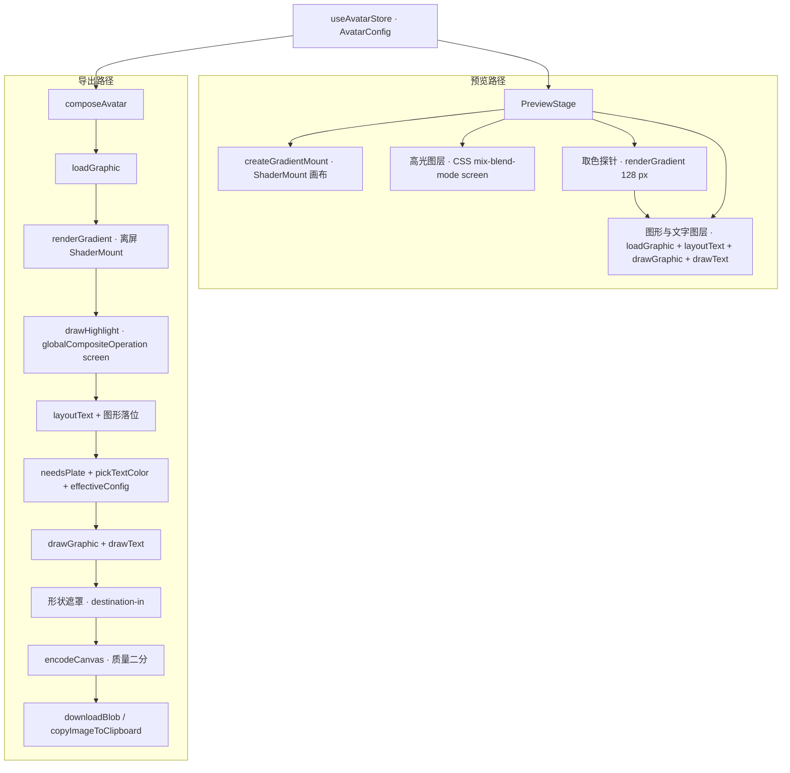

# 架构

渐变头像生成器是一个纯前端静态站：一份可序列化的 `AvatarConfig` 驱动 WebGL 渲染与 2D 合成，产出一张位图并落到磁盘或图片剪贴板。

## 技术栈

| 层 | 选型 | 说明 |
| --- | --- | --- |
| 构建 | Vite 8、`@vitejs/plugin-react`、`vite-plugin-pwa` | 单包根目录应用，产物在 `dist/` |
| 语言 | TypeScript 6 | `strict` 加 `noUncheckedIndexedAccess`，路径别名只用 `@/` |
| 框架 | React 19 | 无路由，单页单视图 |
| 样式 | Tailwind CSS v4、`@tailwindcss/vite` | 主题走 CSS 变量，深浅两套 |
| 组件 | shadcn/ui（CLI 4，Base UI 底层）、lucide-react、cmdk、sonner | 原语在 `src/components/ui/`，跟随上游 |
| 状态 | zustand 5 | 单 store，模块加载即读链接与存档 |
| 渲染 | `@paper-design/shaders` 0.0.80 | WebGL2 fragment shader，Apache-2.0 |
| 颜色 | culori 4 | 全部计算在 OKLCH 空间 |
| 测试 | Vitest 4（jsdom）、Testing Library、Playwright 1.62 | 单测加两组端到端 |
| 规范 | ESLint 10、typescript-eslint、Prettier | `src/components/ui` 与散文目录不进格式化 |
| 托管 | Cloudflare Pages | 构建 `npm run build`，输出 `dist` |

## 目录结构

| 路径 | 职责 |
| --- | --- |
| `src/main.tsx` | 挂 React 根，接上系统主题监听，按条件装端到端探针 |
| `src/App.tsx` | 套 i18n Provider，让文档标题与默认示例文字跟随界面语言 |
| `src/app/` | 应用外壳、顶栏、底部操作条、实时预览、氛围背景、主题状态 |
| `src/app/panels/` | 文字、配色、质感、画布四个面板，加导出抽屉、字体选择器、图形选择器、历史条 |
| `src/components/ui/` | shadcn 生成的原语，本仓不改写、不格式化 |
| `src/components/blocks/` | 面板复用件：分段控件、radio card、带数值的滑杆、颜色格、可折叠分组 |
| `src/engine/` | 质感定义与参数映射、种子、预览挂载、离屏渲染、设备能力探测、无 WebGL2 兜底 |
| `src/engine/shaders/` | 四段 fragment shader 源码，一种质感一份 chunk |
| `src/text/` | 文字量测、换行、自动填满、排版、绘制、自动取色 |
| `src/palettes/` | 26 套内置配色、OKLCH 色彩工具、种子色和谐生成 |
| `src/fonts/` | 精选清单、fontsource 目录缓存、css2 与镜像加载链、本地上传注册 |
| `src/graphics/` | 图形来源分派、lucide Path2D、Noto Emoji、上传消毒、五语 emoji 索引、图形绘制 |
| `src/graphics/generated/` | lucide 全库与精选索引、emoji 基础索引与五语标签，由 `npm run gen:icons` / `gen:emoji` 生成 |
| `src/export/` | 画布合成、编码与体积二分、导出动作、下载、图片剪贴板、文件名 |
| `src/state/` | `AvatarConfig` 契约、zustand store、URL 编解码、本地存档、历史 |
| `src/i18n/` | 五份扁平字典与 Provider |
| `src/hooks/` | 媒体查询与防抖 |
| `tests/` | Vitest 单测，目录与 `src/` 同名 |
| `e2e/` | Playwright 用例，`smoke` 两档都跑，`desktop` 与 `mobile` 各归一档 |
| `scripts/screenshots.mjs` | 设备模拟截图，输出到 `.screenshots/` |
| `public/` | 图标、`_headers`、`_redirects`，随构建进入 `dist/` |

## 共享契约

`src/state/config.ts` 的 `AvatarConfig` 是全仓唯一的参数来源。它同时是 URL hash 的载荷、localStorage 的存档格式与历史条目的内容，所以只允许增字段，不允许改已有字段的语义。

| 字段组 | 内容 | 谁在读 |
| --- | --- | --- |
| `text`、`seed` | 文字内容与随机种子，`seed` 为空时由 `text` 哈希派生 | 引擎、文字、文件名 |
| `style`、`styleParams` | 四种质感之一，加强度、柔和度、颗粒、比例、旋转五个归一化滑杆 | 引擎 |
| `highlight` | 2D 合成阶段的柔白高光强度 | 合成 |
| `palette`、`customColors` | 内置配色 id 或 `custom`，自定义时给 2 到 6 个 hex | 配色、引擎 |
| `canvas` | 宽高、形状、圆角比例 | 合成、导出 |
| `typography` | 字体与来源、字重、字号模式与字号、行级字号比例与水平补偿、边距、行高、字间距、对齐、锚点、偏移、竖排、自动换行、文字效果与强度、取色模式与颜色、胶囊底参数 | 文字、字体 |
| `layout` | 用途（纯文字、状态徽章、图标徽章）、图形比例与图形来源 | 文字排版、图形、URL |
| `exportOptions` | 格式、体积档、底色 | 编码 |

同一模块另外导出三个函数。`DEFAULT_CONFIG` 是默认值的唯一定义处；`normalizeConfig` 把任意局部输入补成完整配置，数值按区间夹值、枚举做合法性校验，任何输入都不抛错；`configHash` 对键排序后做 FNV-1a，用作历史去重与渲染去重的标记。

## 渲染管线

预览与导出走两条独立的路径，共用引擎、文字与图形三个模块，因此参数改动只需落在一处。

预览把三层叠在一个定长方框里：底下是 `ShaderMount` 的 WebGL 画布，中间一张 2D 画布画高光，上面一张 2D 画布按“先图形后文字”绘制，形状裁切交给 CSS。配置停 80 ms 才推给 shader，取色探针再多等一档到 220 ms；图形只按来源与 id 变化重新加载。

导出的顺序是硬性的。高光要压在渐变之上，自动文字色要读高光之后的画面，形状遮罩必须最后做，否则被裁掉的边角会被后续绘制重新填满。合成逻辑在 `src/export/compose-core.ts`，引擎、文字、字体与图形四个模块的真实实现在 `compose.ts` 一处装配，单测因此不必拉起 WebGL、字体网络或 emoji CDN。

预览画布没有开 `preserveDrawingBuffer`，读回来是空的。预览里的自动取色因此另开一条低分辨率探针，用导出同一条 `renderGradient` 路径画一张 128 px 的小图，在上面取色并判断要不要底板。

## 四种质感

`src/engine/styles.ts` 是引擎里唯一知道 shader uniform 名字的地方。面板只认 `styleParams` 的五个滑杆，渲染层只认 `StyleRenderPlan`，换 shader 或调区间都只动这一个文件。

| 质感 | 底层 shader | 参数映射要点 |
| --- | --- | --- |
| `mesh` 柔光 | `staticMeshGradient` | 强度映射到 `u_waveX` 与 `u_waveY`，柔和度映射到 `u_mixing`，两者铺满全程 |
| `flow` 流动 | `meshGradient` | 强度映射到 `u_distortion`，柔和度映射到 `u_swirl` 的补，构图由 `frame` 定 |
| `silk` 丝绸 | `warp` | 底纹以 stripes 为主，浅配色按 OKLCH 平均明度线性压制 `u_distortion` 与 `u_swirl` |
| `grain` 颗粒 | `grainGradient` | 形状池只取 wave 与 corners，去掉会出同心圆的 ripple；两种形状共用 0.45 的缩放倍率 |

包内的四组常量抄进 `styles.ts` 并注明来源，不从包里 import：`meta` 与 shader 源码同在一个模块，静态引用 `meta` 会把那段 GLSL 拖进首屏 chunk。升级包版本时对照 `dist/` 复核这四组值。

`warp` 没有颗粒 uniform，缺的那份由 `src/engine/film-grain.ts` 在 2D 阶段补上，做法是一张种子噪声小图平铺后 overlay 混合。

## 文字排版

`fitText` 找出能让整块文字装进安全框的最大字号。单段且不再换行时块尺寸随字号线性变化，用一次探针测量直接算出比例；其余情况在 `MIN_FONT_RATIO` 到 `MAX_FONT_RATIO` 之间二分 12 轮，因为换行本身能换来更大的字号，一步到位会把结果卡死在单行。

横排的每一行可以乘自己的 `lineSizeScales`，也能按 `lineOffsetsX` 做水平视觉补偿。求解时每行先按自己的字号度量，自动填满以这些行的实际包络为准；绘制层按行设置 `ctx.font`，描边、投影、发光的尺度也随之按行走。自动换行产生的续行沿用源段落的行级参数，显式换行才进入下一个行级索引。文字面板把这两组行级控件放在全局字号之前，行级字号还带一个常驻数值框，可直接输入百分比。

安全框由 `typography.padding` 从画布四边扣出，默认值 0.15；`typography.lineHeight` 默认 1.03。量宽一律走 canvas `measureText`，CJK 逐字换行、拉丁按词换行。竖排把每一列当成一行处理，列宽全列统一。

自动文字色分两档。内置配色直接用配色表里的 `text` 设计值，同一配色下每块文字都是同一个颜色，高光、颗粒与种子都改不动它。自定义配色没有设计值，走像素判定，门槛是文字区域相对亮度 0.5，低于此取白字。

两个候选色都到不了对比度 3.0 时，`needsPlate` 判真，`effectiveConfig` 返回一份把文字效果换成胶囊底的配置。用户的 `config` 不动：底板是引擎替他兜的底，写回配置会连带进链接与存档，下次打开就分不清是谁改的。这一步只在自动取色加纯色文字的组合下代劳。

图标徽章的排版同样在 `layoutText` 里求解。图形先按安全框高度的 `layout.graphic` 等比缩放，宽度超出时改按宽度约束；文字拿到剩余高度并水平居中。文字为空时图形居中，图形缺失时文字退回整块安全框居中。版式固定，锚点、对齐、竖排与行级补偿不参与。

## 图形来源

`src/graphics/source.ts` 是唯一分派入口：内置图标、emoji 与上传图形都按需 `import()`，主界面不带索引。三种来源统一返回 `Graphic`，调用方不认识具体实现。

| 来源 | 索引 | 图形 |
| --- | --- | --- |
| 内置图标 | lucide-react 1.37 的 1790 个主图标；精选 162 个随选择器小索引加载，全库 470 KB 原始数据只在搜索超出精选时加载 | `__iconNode` 转 `Path2D`，按文字色描边，并复用文字效果 |
| emoji | emojibase-data 15.0.0 的 1879 个可分组条目，五种语言各一份标签 chunk | 按码点取 Noto Emoji v2.047 单个 SVG，fetch 转 Blob 再画，保留原色 |
| 上传 | 无索引，模块级会话注册表 | SVG 先经元素与属性白名单重建；PNG / WebP 直接 `Image`，保留原色 |

上传 SVG 只保留常见绘图元素、渐变、裁剪与安全展示属性；未知元素整支丢弃，未知属性删除，`url()` 只允许内部引用。注册后的 id 不写进 URL、localStorage 或历史，分享时降级为 `none`。加载失败只让图形位留空，渐变、文字与导出继续可用。

## 字体

加载入口是 `src/fonts/loader.ts` 的 `loadFontForConfig`，绘制前必须等 `document.fonts.load` 就绪，否则画布会用回退字形出图。

| 档 | 来源 | 说明 |
| --- | --- | --- |
| 1 | Google Fonts css2 | 返回的 `@font-face` 全部带 `unicode-range`，浏览器只拉用到的切片。不加 `text=` 参数，Noto CJK 上它不生效 |
| 2 | `cdn.jsdelivr.net` 上的 `@fontsource` CSS | 走 npm 包路径，每条分片都带 `unicode-range` |
| 3 | `gcore.jsdelivr.net` 上的同一份 CSS | 同上，换主机 |
| 4 | 系统字体栈 | 界面提示已回落 |

每一档各有 4 秒等待上限。字体目录来自 fontsource 公共 API，裁掉用不上的字段后按 7 天缓存进 localStorage，只保留 `type` 为 google 的条目；接口不可用时回落到 `curated.ts` 的精选清单，它覆盖 Google Fonts 上全部带中文 subset 的字体。

上传的 TTF、OTF、WOFF、WOFF2 用 `FontFace` 直接注册，不解析字体文件。注册表在模块级，family 名带 `-upload` 后缀，只在本次会话有效。

## 配色

`src/palettes/palettes.ts` 用一张元组表定义 26 套配色，归到 15 个家族。每套的字段是 id、家族、明暗、2 到 6 个停靠色、推荐文字色、留白底色，以及五种语言的名字。配色名不进 i18n 字典，直接按 `useLocale()` 从 `PALETTES[i].name[locale]` 取。`PLATE_HINT_IDS` 列出推荐文字色对最差停靠点低于 WCAG 4.5 的配色，界面据此默认开启胶囊底。

种子色生成在 `harmony.ts`：给一个主色，按类比、分裂互补、同色相三种方案在 OKLCH 里排出 5 档明度阶梯加 1 个光感点；给两个主色则沿短弧在两个色相之间取档。明度阶梯与 chroma 系数都是定值，同一种子色永远得到同一套。

culori 只从 `src/palettes/culori.ts` 进来，其余文件一律不直接 `import 'culori'`。按需入口不注册任何色彩空间，用到哪个自己注册哪个，本仓的最小集就在那个文件里。

确定性随机在 `src/engine/seed.ts`：`hashSeed` 是 FNV-1a 32 位，`mulberry32` 只做整数运算，同一种子在任何设备上给出同一串数字。`resolveSeed` 定义了种子的派生规则，`seed` 为空退到 `text`，两者都空用常量。合成时高光也必须调它，否则空白种子下高光与渐变会用两串不同的随机数。

## 状态与持久化

单个 zustand store 持有 `config`、`history` 与 `ui` 三段。面板只调 `setConfig` 一类的动作，动作内部逐层深合并再过一遍 `normalizeConfig`。

初始配置的优先级是 URL hash、localStorage、默认值，链接分享出去要能覆盖本机存档。`initialConfigSource()` 记下它来自哪一档，默认示例文字只在 `default` 这一档才跟随界面语言。URL hash 只编码与当前默认值的差异，所以修改默认值会改变省略该字段的旧链接；显式字段始终按用户给的值渲染。

状态变更后攒 300 ms 写一次，同时落 localStorage 与 `history.replaceState`。用 `replaceState` 而不是给 `location.hash` 赋值，后者每次调参都会往浏览器历史里塞一条。导出前调 `flushConfigSync()` 立刻落盘，别让用户复制到旧链接。

历史最多 8 条，按 `configHash` 去重，与配置一起进同一份存档。存档键名带版本号，换结构时旧数据自然失效。

## 界面多语言

字典是扁平的点分 key，五种语言：简体中文、繁体中文、English、日本語、한국어。zh-CN 是源语言，其余四份用 `typeof zhCN` 约束，少一个 key 就在 typecheck 报错。

只有 zh-CN 与 en 静态打进首屏，前者是默认语言，后者是所有字典的兜底；其余三份各自一份 chunk，切过去时先用手上这份渲染一帧，字典到了再重绘。

`t()` 的 key 类型是 `I18nKey | (string & {})`，引擎给的 `labelKey` 这类动态 key 在类型上就是 string，卡死成联合类型会逼调用方到处断言。放宽之后由 `tests/i18n/keys.test.ts` 扫源码补上这一层校验。

`app.sampleText` 是每种语言的默认示例文字。判据是当前文字仍等于某种语言的示例，所以用户一旦自己打过字就再也不会被顶掉。

## 代码分割与首屏预算

首屏 JS 上限 250 KB gzip，v3.2 实测 200.22 KB。量法按 `dist/index.html` 里的 entry script 加全部 `modulepreload` 求 gzip 之和：打包器会把入口与懒加载的共同依赖提成独立 chunk，Vite 给它们发 `modulepreload`，它们同样在首屏下载，只看 index chunk 会低估。

三条规则守住这个上限。

- 要拆的包，主 chunk 里一个符号都不能静态引用。`@paper-design/shaders` 只从 `shader-mount.ts`、`shader-noise.ts` 与 `shaders/*.ts` 三个薄模块进来，全部走 `import()`。
- 不用 `const { X } = await import('包名')` 从包入口取符号，命名空间访问挡住 tree-shaking。要拆就先写一个只 `export { X } from '包名'` 的本地模块，再动态 import 它。
- 懒组件一挂进树就立刻拉 chunk。导出抽屉、字体选择器与历史条都走 `panels/lazy.ts`，并且只在真要显示时才挂上，之后一直留着。这个挂载闩是 store 的 `ui.exportMounted`，由 `setUi` 从 `exportOpen` 派生。图形选择器同走 `lazy.ts`，没点开前不拉 cmdk 与索引；内置全库、emoji 标签也只在对应搜索模式需要时加载。

详细口径见 `docs/engineering-lessons.md`。

## 测试

| 层 | 命令 | 覆盖 |
| --- | --- | --- |
| 单测 | `npm test` | `tests/` 与 `src/` 同名，jsdom 环境，覆盖种子映射、排版与自动填满、图标排版、SVG 消毒、图形绘制消费端、索引结构、自动取色、体积二分、URL 编解码、字典对齐 |
| 端到端 | `npm run e2e` | 两个 project：`desktop` 跑 1440 桌面，`iphone-15` 跑设备模拟。覆盖内置图标、emoji、上传 SVG、手机底部抽屉与既有导出路径 |
| 视觉 | `npm run screenshots` | 桌面 1440、iPhone 15、iPhone SE 三个设备各截深浅两套主题，输出到 `.screenshots/` |

headless chromium 默认没有 GPU，WebGL2 靠 `--use-angle=swiftshader` 等启动参数走软件渲染。`devices['iPhone 15']` 的默认浏览器是 webkit，project 里必须显式覆盖成 chromium，否则那几个参数不生效。

预览画布读不回像素，端到端断言因此走探针。`src/app/probe.ts` 把 `composeAvatar` 与 `encodeCanvas` 挂到 `window.__gradientAvatarProbe`，用的是与真实导出完全相同的那条链路。它只在开发模式或 URL 带 `?probe=1` 时用 `import()` 装，产品代码一处都不引用它，不带参数打开就不会下载那份 chunk。

## 构建与部署

`npm run build` 先 `tsc -b` 再 `vite build`，产物在 `dist/`。CI 在每次 push 与 pull request 上跑 lint、typecheck、单测、构建四步，Node 24。

Cloudflare Pages 的构建命令是 `npm run build`，输出目录 `dist`，Node 版本读 `.node-version`。`public/_headers` 给全站发安全头、给 `/assets/*` 发一年不可变缓存，`public/_redirects` 做单页回退，两份文件随构建进入输出目录。

PWA 由 `vite-plugin-pwa` 生成 manifest 与 service worker，注册方式是自动更新，预缓存覆盖 js、css、html、svg、png、woff2。

## 能力边界

- 没有 WebGL2 的浏览器会拿到静态近似图。预览是多层 CSS `radial-gradient`，导出是同源同种子的 2D 近似，两者构图一致，界面明确提示。
- 导出尺寸受设备限制。`caps.ts` 同时探测 WebGL 上限与 2D 画布面积上限，取较小值，超出时按上限渲染再放大，导出面板显示本机的最高原生边长。探测结果缓存 7 天。
- 主“导出”按钮直接触发浏览器下载；导出抽屉提供“下载”与“复制图片”两个显式动作。微信内置浏览器拦截 `a[download]`，那里改为提示长按图片保存。
- WebP 只在 `toBlob('image/webp')` 实际返回 `image/webp` 的浏览器里提供，不引入 WASM 编码器。PNG 无损，体积不可控，靠界面提示。
- 上传的字体与图形只在本次会话有效，不写盘、不进链接、不进存档；分享链接中的上传图形退回空来源。
